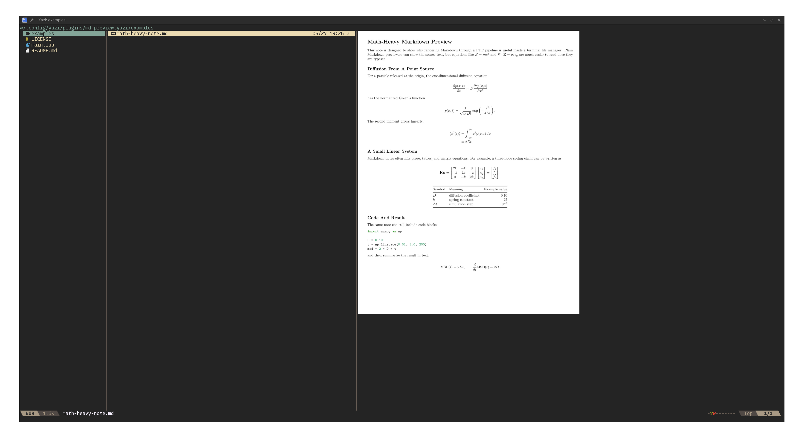

# md-preview.yazi

Rendered Markdown image previews for [Yazi](https://github.com/sxyazi/yazi).

`md-preview.yazi` turns Markdown into a temporary PDF with Pandoc and XeLaTeX,
then rasterizes the selected page to a PNG for Yazi's image preview pane. It is
useful for notes, reports, and Markdown files that rely on math, figures, or PDF
layout.



## Why

Terminal Markdown previewers are good for plain text, but they generally cannot
typeset TeX equations with the same layout you get from a PDF renderer. Math-heavy
Markdown often ends up showing raw `$...$` or `$$...$$` source instead of readable
equations.

`md-preview.yazi` takes a different route: it lets Pandoc and XeLaTeX typeset the
Markdown first, then shows the rendered page as an image in Yazi. That makes
equations, figures, and page layout previewable without leaving the file manager.

## Features

- Renders Markdown through Pandoc's PDF pipeline.
- Supports TeX math through Pandoc Markdown extensions.
- Shows each rendered PDF page as an image preview.
- Shows the current page and total page count.
- Uses Yazi's preview seeking to move between pages.
- Caches rendered PDFs under `$XDG_CACHE_HOME/yazi/md-preview`.

## Requirements

- [Yazi](https://github.com/sxyazi/yazi) and `ya`; tested with Yazi 26.5.6.
- [Pandoc](https://pandoc.org/)
- A XeLaTeX installation available as `xelatex`
- Poppler utilities: `pdfinfo` and `pdftoppm`

## Installation

With Yazi's package manager:

```sh
ya pkg add anyuzx/md-preview
```

Or clone it manually:

```sh
git clone https://github.com/anyuzx/md-preview.yazi.git \
  ~/.config/yazi/plugins/md-preview.yazi
```

Then add the previewer to `yazi.toml`:

```toml
[plugin]
prepend_previewers = [
  { url = "*.md", run = "md-preview" },
  { url = "*.markdown", run = "md-preview" },
]
```

If your config already has a `[plugin]` section, merge only the two
`prepend_previewers` entries.

## Usage

Open a Markdown file in Yazi and move the cursor onto it to preview the rendered
page. For multi-page documents, use Yazi's default preview seek keys: `J` moves
forward and `K` moves backward through the rendered pages. The preview footer
shows the current page and total page count.

## Configuration

Optional render settings can be passed as previewer arguments in `yazi.toml`:

```toml
[plugin]
prepend_previewers = [
  { url = "*.md", run = "md-preview --geometry=margin=0.35in --raster-dpi=192" },
  { url = "*.markdown", run = "md-preview --geometry=margin=0.35in --raster-dpi=192" },
]
```

Change `--geometry` to adjust the PDF page margin and `--raster-dpi` to trade
preview sharpness for render time and cache size. These values are included in
the cache key, so changing them creates fresh previews after Yazi reloads your
`yazi.toml`.

## Troubleshooting

- `Failed to start pandoc`: install Pandoc and make sure it is on `PATH`.
- `Failed to render Markdown with Pandoc`: check that XeLaTeX and any LaTeX
  packages required by your document are installed.
- `Failed to start pdfinfo` or `pdftoppm`: install Poppler utilities.
- Configuration changes do not apply to an already-running Yazi instance; restart
  Yazi after editing `init.lua`.
- Stale previews: remove `$XDG_CACHE_HOME/yazi/md-preview` or
  `~/.cache/yazi/md-preview`.

## Related

- [Yazi plugins](https://github.com/yazi-rs/plugins)
- [Yazi configuration docs](https://yazi-rs.github.io/docs/configuration/yazi/)
